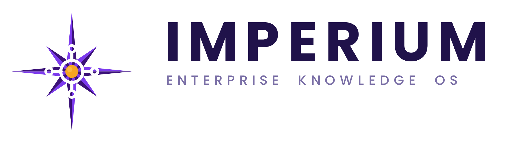

<p align="center">
  
</p>

# Imperium

Enterprise Knowledge Operating System (EKOS).

Repository intelligence + human-verified knowledge base + governed incremental
modernization. Imperium reads an organization's whole codebase, remembers *why* it
exists, and modernizes it under human approval — while tracking not just **code
drift** but **comprehension drift** (what a team understands vs. what AI shipped).

> Status: **working multi-agent system.** The LangChain agent layer, multi-graph
> intelligence, enterprise-scale (map-reduce) analysis, and durable LangGraph
> orchestration with human-gate interrupts are implemented and tested. The frontend
> is a build spec + scaffold; a few intelligence scanners and some read APIs remain.

## What works today

- **Per-agent LLM layer** — each agent role routes to its own provider chain
  (NVIDIA / Groq / Gemini / Cerebras / Mistral) via LangChain `ChatOpenAI` with
  automatic fallback, streaming, and token accounting. No OpenAI.
- **Tool-using agents** — research / security / compatibility investigate with
  read-only tools over the engine (semantic memory, call graph, API/data graphs,
  source); every agent has a working implementation.
- **Multiple graph layers** — call, dependency, **API** (`EXPOSES`/`CONSUMES`) and
  **data** (`READS`/`WRITES`) graphs written to Neo4j and traversable by agents.
- **Enterprise scale** — analysis runs map-reduce over the module hierarchy
  (priority-ordered, concurrent, deduped) so it survives million-LOC codebases.
- **Durable, gated orchestration** — a checkpointed LangGraph run
  (`build_kb → analyze → Gate A → simulate → Gate B → finalize`) that suspends at
  the human gates and resumes, surviving restarts. Driven via `/api/runs` + SSE.

## Layout

```
imperium/
├── docker-compose.yml     # postgres, qdrant, neo4j, redis
├── .env.example           # copy → .env
├── backend/               # Python — FastAPI, agents, intelligence engine, RKB
└── frontend/              # TypeScript/React — structure map, Gate A/B UIs
```

## Architecture map (TDD → code)

| TDD section | Code location |
|---|---|
| 4. Repository Intelligence Engine | `backend/imperium/intelligence/` (parser, call_graph, `api_mapper`, `db_mapper`, `multigraph`) |
| 5. Repository Knowledge Base (RKB) | `backend/imperium/rkb/` (Postgres + Qdrant + Neo4j) |
| 6. Memory Architecture (RAG) | `backend/imperium/rkb/store.py`, `embeddings.py`, `graph.py` |
| 7. Human-in-the-Loop | `backend/imperium/api/routes/gates.py`, gate interrupts in `core/graph_orchestrator.py` |
| 8. Multi-Agent Architecture | `backend/imperium/agents/` (tools, `agent_factory`, `scale`), `core/orchestrator.py` |
| 8. Per-agent LLM routing | `backend/imperium/llm/` (`routing.py`, `factory.py`, `client.py`) |
| 8. Durable orchestration | `backend/imperium/core/graph_orchestrator.py`, `runs.py`, `api/routes/runs.py` |
| 9. Incremental Transformation | `backend/imperium/agents/implementation.py`, `sandbox/` |
| 10. Integrations | `docker-compose.yml`, `rkb/*`, `llm/client.py` |
| Frontend (premium IDE spec) | `docs/frontend-build-guide.md`, `frontend/src/` |

## Quick start

```bash
# 1. backing services
cp .env.example .env
docker compose up -d

# 2. backend
cd backend
python -m venv .venv && source .venv/bin/activate
pip install -e ".[dev]"
uvicorn imperium.main:app --reload
# → http://localhost:8000/health   http://localhost:8000/docs

# 3. frontend
cd ../frontend
npm install
npm run dev
# → http://localhost:5173
```

## Pipeline (TDD §3)

Repository → Intelligence Engine → Parsing → Multi-graph (call / dependency / API /
data) → Knowledge Extraction → RKB → Human Verification (Gate A) → Simulation →
Behavioral Diff (Gate B) → Documentation → Comprehension checks

Run it as a durable, resumable job:

```bash
# start a run (drives to Gate A in the background)
curl -X POST localhost:8000/api/runs -d '{"repository_id":"<id>"}' -H 'content-type: application/json'
curl localhost:8000/api/runs/<run_id>                 # status / stage / pending gate
curl -N localhost:8000/api/runs/<run_id>/events        # live SSE stream
curl -X POST localhost:8000/api/runs/<run_id>/resume -d '{"votes":{"security":"approve"}}' -H 'content-type: application/json'
```

## Status detail

**Done:** LangChain LLM layer · all agents implemented (tool-using where it helps) ·
API + data + dependency graph mappers → Neo4j · map-reduce scaling over modules ·
durable LangGraph orchestration with Gate A/B interrupts · run lifecycle + SSE.
Backend tests: `cd backend && .venv/bin/python -m pytest` (37 passing).

**Remaining:** frontend UI (spec in `docs/frontend-build-guide.md`) · read APIs for
the graph layers / hierarchy / priorities / usage · deeper `simulate`→changeset
wiring in the durable pipeline · `security_scanner` / `test_coverage` /
`language_detection` scanners · incremental (churn-gated) re-analysis.
